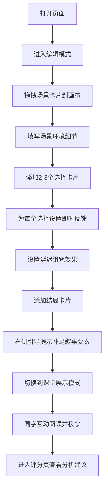

## 1. 产品概述
分支诅咒剧情练习器是一款面向游戏设计专业学生和恐怖叙事课程的纯前端教学工具，帮助初学者理解"分支不是越多越好，而是每条都要有恐惧意义"的设计理念。通过拖拽式编辑、叙事要素引导、课堂展示和教学评分四大模块，让学生在实践中掌握恐怖叙事的核心技巧。

## 2. 核心特性

### 2.1 用户角色
| 角色 | 注册方式 | 核心权限 |
|------|----------|----------|
| 学生 | 无需注册 | 创建、编辑诅咒剧情，查看评分建议 |
| 教师 | 无需注册 | 课堂展示模式、发起投票、查看分析结果 |

### 2.2 功能模块
1. **编辑模式页**：左侧卡片面板、中间画布、右侧叙事引导
2. **课堂展示页**：玩家视角互动阅读、投票功能
3. **评分分析页**：分支覆盖度、诅咒规则清晰度、惊吓节奏建议

### 2.3 页面详情
| 页面名称 | 模块名称 | 功能描述 |
|---------|----------|----------|
| 编辑模式页 | 左侧卡片面板 | 场景、选择、诅咒效果、结局四类可拖拽卡片 |
| 编辑模式页 | 中间编辑画布 | 拖入卡片后可编辑内容、设置关联关系 |
| 编辑模式页 | 右侧引导提示 | 误导线索、代价递增、规则反转、结局回扣四项要素检查与提示 |
| 课堂展示页 | 玩家视角阅读 | 隐藏编辑信息，只呈现剧情文本和选择按钮 |
| 课堂展示页 | 投票系统 | 同学投票选择路线，实时显示投票结果 |
| 评分分析页 | 分支覆盖度 | 统计已探索分支占总分支的比例 |
| 评分分析页 | 诅咒规则分析 | 检查诅咒设定的一致性与清晰度 |
| 评分分析页 | 惊吓节奏建议 | 分析恐惧点分布节奏，给出优化建议 |

## 3. 核心流程

## 4. 用户界面设计

### 4.1 设计风格
- **主色调**：深邃墨黑 `#0a0a0f` 为主背景，血红 `#8b0000` 为强调色
- **辅助色**：暗紫 `#2d1b4e`、腐朽棕 `#3d2914`、幽蓝 `#1a2a3a`
- **按钮风格**：做旧边框，悬停时浮现血色光晕，点击时轻微抖动
- **字体**：标题使用哥特风格衬线字体（Cinzel），正文使用简洁无衬线字体（Noto Sans SC）
- **布局**：三栏式编辑器，卡片拖拽时有鬼影拖尾效果
- **视觉元素**：噪点纹理叠加、角落蛛网装饰、蜡烛光效动画、文字打字机效果

### 4.2 页面设计概览
| 页面名称 | 模块名称 | UI元素 |
|---------|----------|--------|
| 编辑模式页 | 左侧卡片面板 | 四类卡片悬浮堆叠，hover时上浮+发光，拖拽时半透明鬼影 |
| 编辑模式页 | 中间画布 | 深木纹背景，卡片连接虚线，激活时蜡烛光圈效果 |
| 编辑模式页 | 右侧引导栏 | 四项要素 checklist，完成项打勾带血渍效果，未完成项有脉动提示 |
| 课堂展示页 | 阅读区域 | 打字机逐字显示，选择按钮逐个浮现，背景有轻微呼吸动画 |
| 课堂展示页 | 投票区域 | 血渍进度条，投票数字跳动动画，选择高亮闪烁 |
| 评分分析页 | 数据面板 | 复古仪表盘样式，进度条有腐蚀边缘效果，建议文字打字机出现 |

### 4.3 响应式
- 桌面端优先（教学场景主要使用投影/大屏）
- 平板端自适应双栏布局
- 移动端简化为单栏堆叠模式

### 4.4 动效设计
- **页面加载**：蜡烛依次点亮，元素从黑雾中浮现
- **卡片拖拽**：跟随鼠标的半透明鬼影，拖尾渐隐效果
- **文字出现**：打字机效果，光标闪烁，错误时字符抖动
- **诅咒触发**：画面短暂故障效果（CRT扫描线+色差偏移），音效提示
- **投票统计**：数字快速跳动，进度条如血液蔓延
- **模式切换**：百叶窗过渡效果，伴随"嘎吱"声
