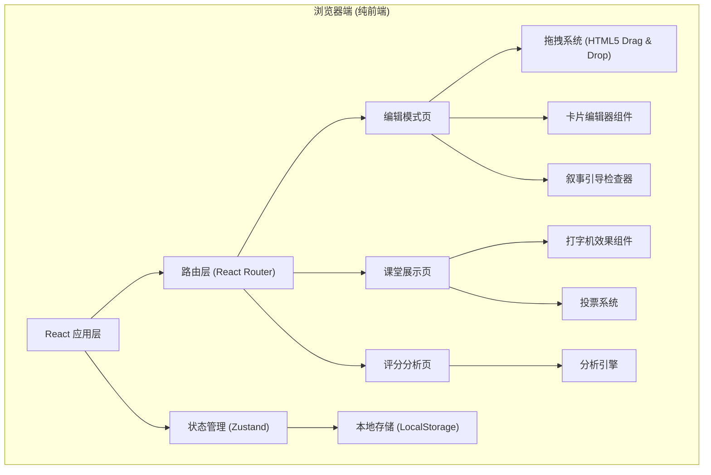
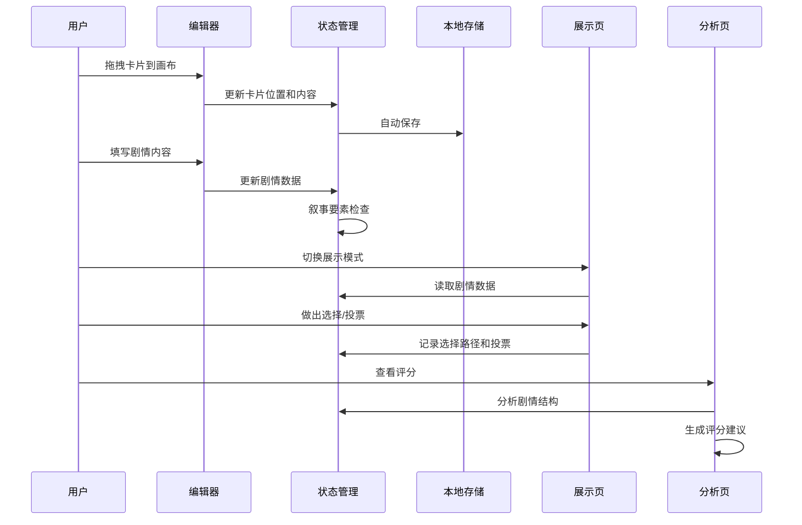

## 1. 架构设计



## 2. 技术描述
- **前端框架**：React@18 + TypeScript
- **构建工具**：Vite@5
- **状态管理**：Zustand@4
- **路由**：React Router DOM@6
- **样式**：TailwindCSS@3 + CSS Variables
- **图标**：Lucide React
- **数据持久化**：LocalStorage（纯前端，无需后端）
- **初始化命令**：`npm init vite-init@latest -y . "--" --template react-ts --force`

## 3. 目录结构
```
src/
├── components/
│   ├── editor/
│   │   ├── CardPanel.tsx      # 左侧卡片面板
│   │   ├── Canvas.tsx         # 中间编辑画布
│   │   ├── DraggableCard.tsx  # 可拖拽卡片
│   │   ├── SceneEditor.tsx    # 场景编辑器
│   │   ├── ChoiceEditor.tsx   # 选择编辑器
│   │   ├── CurseEditor.tsx    # 诅咒效果编辑器
│   │   └── EndingEditor.tsx   # 结局编辑器
│   ├── guide/
│   │   └── NarrativeGuide.tsx # 右侧叙事引导栏
│   ├── display/
│   │   ├── PlayerView.tsx     # 玩家视角阅读
│   │   ├── Typewriter.tsx     # 打字机效果组件
│   │   └── VotingPanel.tsx    # 投票面板
│   ├── analysis/
│   │   ├── BranchCoverage.tsx # 分支覆盖度
│   │   ├── CurseClarity.tsx   # 诅咒规则清晰度
│   │   └── PacingAnalysis.tsx # 惊吓节奏分析
│   └── common/
│       └── ModeToggle.tsx     # 模式切换按钮
├── store/
│   └── useStoryStore.ts       # 全局状态管理
├── pages/
│   ├── EditorPage.tsx         # 编辑模式页
│   ├── DisplayPage.tsx        # 课堂展示页
│   └── AnalysisPage.tsx       # 评分分析页
├── types/
│   └── story.ts               # 类型定义
├── utils/
│   ├── analysis.ts            # 分析引擎
│   └── narrativeGuide.ts      # 叙事引导逻辑
├── App.tsx
├── main.tsx
└── index.css
```

## 4. 路由定义
| 路由 | 页面 | 用途 |
|------|------|------|
| `/` | 编辑模式页 | 默认页面，拖拽编辑剧情 |
| `/display` | 课堂展示页 | 玩家视角互动阅读 |
| `/analysis` | 评分分析页 | 查看分析和建议 |

## 5. 数据模型

### 5.1 核心类型定义

```typescript
// 卡片基础类型
interface BaseCard {
  id: string;
  type: 'scene' | 'choice' | 'curse' | 'ending';
  x: number;
  y: number;
}

// 场景卡片
interface SceneCard extends BaseCard {
  type: 'scene';
  title: string;
  description: string;
  environmentDetails: string;
  atmosphere: string;
  isEntry: boolean;
  nextChoices: string[]; // 关联的选择ID
}

// 选择卡片
interface ChoiceCard extends BaseCard {
  type: 'choice';
  text: string;
  immediateFeedback: string;
  delayedConsequence: {
    curseId: string;
    delayScenes: number; // 延迟几幕触发
  } | null;
  nextSceneId: string | null;
  endingId: string | null;
}

// 诅咒效果卡片
interface CurseCard extends BaseCard {
  type: 'curse';
  name: string;
  description: string;
  triggerCondition: string;
  visualEffect: string;
  severity: 'mild' | 'medium' | 'severe';
}

// 结局卡片
interface EndingCard extends BaseCard {
  type: 'ending';
  title: string;
  description: string;
  type: 'good' | 'bad' | 'neutral' | 'twist';
  callback: string; // 结局回扣内容
}

// 叙事要素检查
interface NarrativeElements {
  redHerring: boolean; // 误导线索
  increasingCost: boolean; // 代价递增
  ruleReversal: boolean; // 规则反转
  callback: boolean; // 结局回扣
  hints: string[];
}

// 投票记录
interface VoteRecord {
  choiceId: string;
  count: number;
  voters: string[];
}

// 完整剧情状态
interface StoryState {
  cards: (SceneCard | ChoiceCard | CurseCard | EndingCard)[];
  connections: { from: string; to: string }[];
  narrativeElements: NarrativeElements;
  votes: Record<string, VoteRecord>;
  exploredPaths: string[][];
  currentMode: 'edit' | 'display' | 'analysis';
}
```

### 5.2 数据流转



## 6. 核心算法

### 6.1 分支覆盖度计算
```typescript
function calculateBranchCoverage(
  allPaths: string[][], 
  exploredPaths: string[][]
): {
  coverage: number;
  totalBranches: number;
  exploredBranches: number;
  missingBranches: string[][];
}
```

### 6.2 诅咒规则清晰度分析
```typescript
function analyzeCurseClarity(
  curses: CurseCard[],
  choices: ChoiceCard[]
): {
  score: number;
  consistent: boolean;
  issues: string[];
  suggestions: string[];
}
```

### 6.3 惊吓节奏分析
```typescript
function analyzePacing(
  scenes: SceneCard[],
  curses: CurseCard[],
  connections: { from: string; to: string }[]
): {
  pacingChart: { scene: string; intensity: number }[];
  rhythm: 'too-fast' | 'too-slow' | 'well-paced';
  suggestions: string[];
}
```
